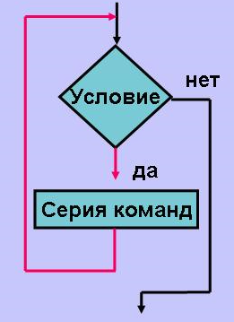

В Python существует 2 типа циклических конструкций:
* цикл `while`
* цикл `for`

Оператор `while`, в свою очередь, позволяет реализовывать два типа циклических алгоритмов:
* цикл с предусловием
* цикл с постусловием

_Пример 1_

Вам необходимо написать программу, которая будет заряжать батареи смартфонов. Начальный уровень заряда у всех устройств разный, целевой - 100%. При его достижении выводится сообщение "Батарея полностью заряжена". При подключении устройства с уровнем заряда 100% программа не осуществляет заряд, сразу выводит сообщение "Батарея полностью заряжена".

```python
from random import randint

# для имитации неизвестного заранее уровня заряда
# батареи будем использовать случайное число от 0 до 100
battery = randint(0, 100)

print(f"Подключено устройство с уровнем заряда {battery}%")

while battery < 100:  # пока уровень заряда батареи меньше 100%
    print("Заряжаю батарею...")
    battery += 1  # увеличиваем заряд батареи на 1%
    print(f"Заряд: {battery}%")
    print()

print("Батарея полностью заряжена")  # вывод сообщения ПОСЛЕ цикла
```

Здесь необходимо использовать цикл с **пред**условием, так как возможна ситуация, при которой _тело цикла_ не будет выполнено ни разу.

<div align="center">
    
</div>

На блок-схеме выше изображен цикл с предусловием (условие **перед** телом цикла). Серия команд (тело цикла) может ни разу не выполниться - черная стрелка (ветка "нет").

В примере, который мы привели выше, это ситуация, при которой подключается заряженное на 100% устройство.

_Пример 2_

